## Оголошення
Проект **«Оголошення»** - це мій перший веб-додаток, який я написав одразу після завершення самостійного вивчення необхідних фреймворків та мов програмування. Основна ідея – це швидке створення та редагування тимчасових оголошень. Наприклад, нова страва у ресторані, або відкриття музею, вечірка і т. д. Він написаний з використанням технологій **ASP.NET Web API** та **Entity Framework Core** на мовах **С#,  HTML, CSS та JavaScript**. Для збереження даних у цьому проекті я використав базу даних **SQLite**.

Архітектура проекту відповідає принципам **REST API** та використовує **Middleware** для кожної сторінки веб-додатку. Крім того, були додані **два фонові сервіси**. Перший сервіс відповідає за автоматичне перемикання властивості 'Активне' у оголошеннях для їх відображення на головній сторінці, керуючись датами створення та закінчення оголошень. Другий сервіс призначений для видалення тимчасових фото, які користувачі завантажують на сервер, але не створюють оголошення з різних причин. Цей сервіс автоматично видаляє тимчасові фото годину після їх завантаження.

### Головна сторінка
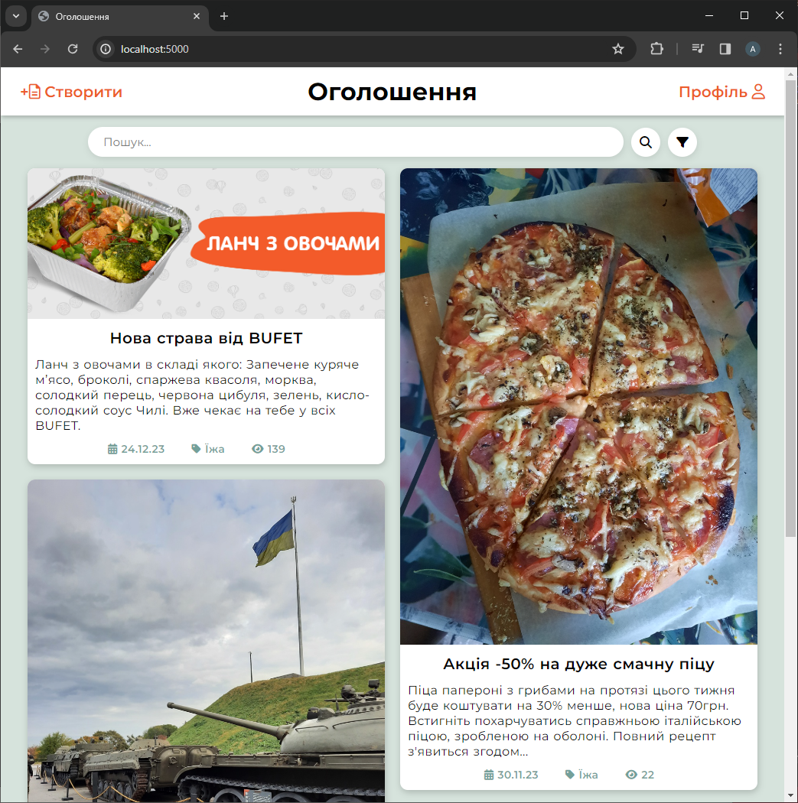

На головній сторінці доступні дві навігаційні опції: **'Створити оголошення'** та **'Профіль'**. Тут відображені всі активні оголошення, при натисканні на них - відбудеться перехід на сторінку з повною інформацією про одне з оголошеннь. 

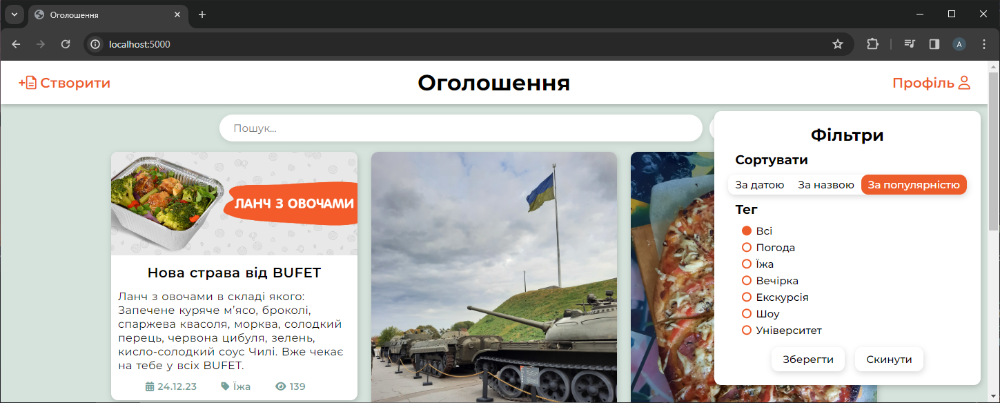

Додатково, користувач може скористатися функцією **пошуку** за ключовим словом та **фільтруванням** оголошень за категорією, датою, популярністю та назвою.

### Сторінка оголошення
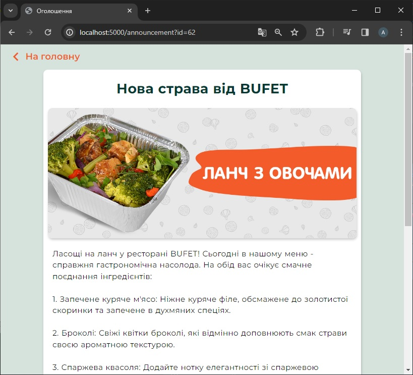
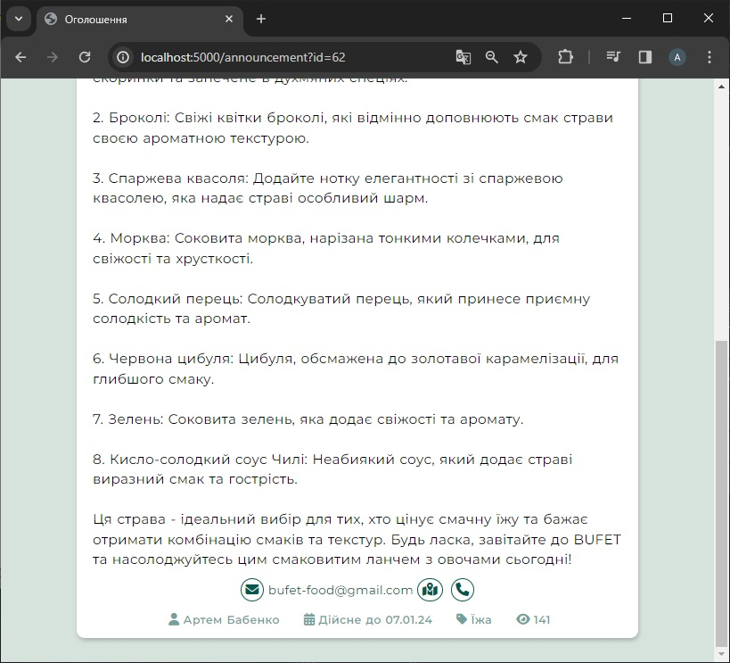

Тут представлена **вся інформація щодо оголошення**, включаючи фотографії, назву, опис, контактну інформацію та інші дані.

### Створення
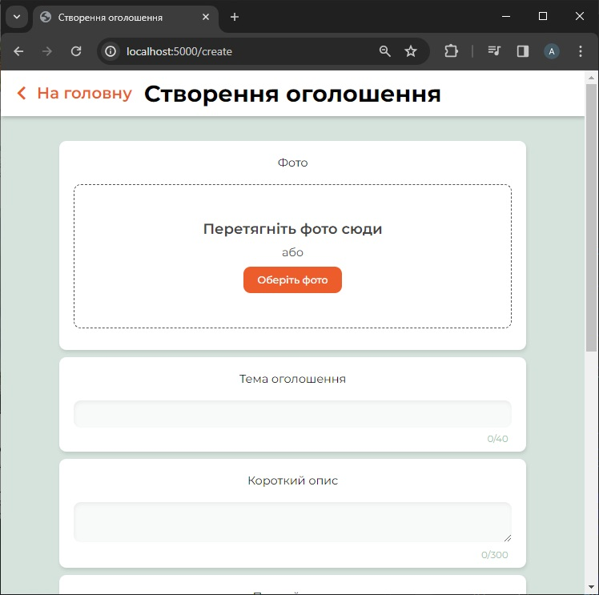
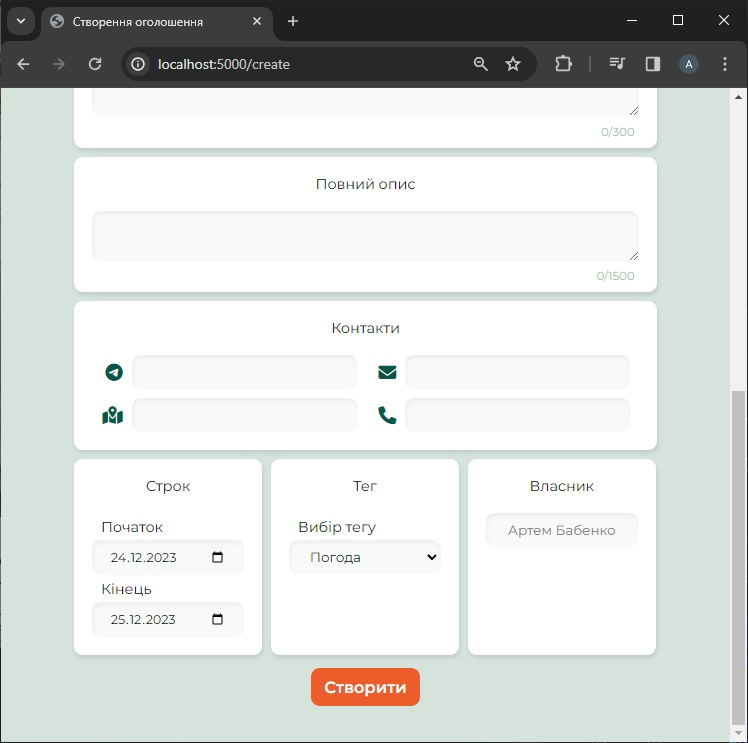

На цій сторінці користувач має можливість створити оголошення та налаштувати йому різноманітні властивості, такі як назва, опис, контактна інформація, теги та дати. Важливою умовою для створення оголошення є обов'язкова наявність фотографії.

### Профіль користувача
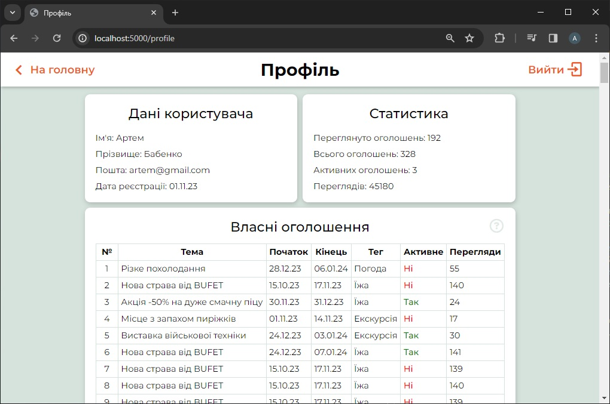
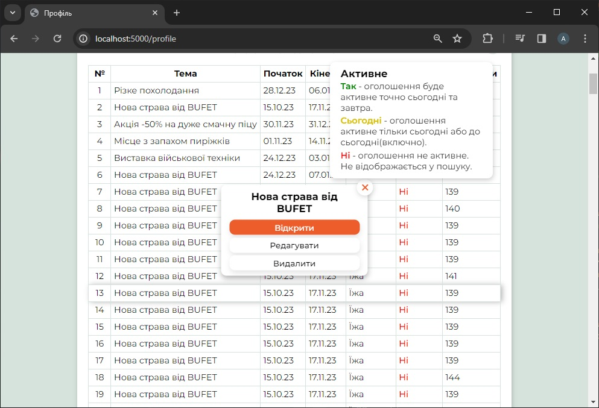

Використовуючи свій профіль, користувач може проводити **аналіз**, **редагувати** та **видаляти** свої оголошення. Крім того, доступна невелика **статистика**, яка надає огляд інформації по всім розміщеним оголошенням.

### Редагування
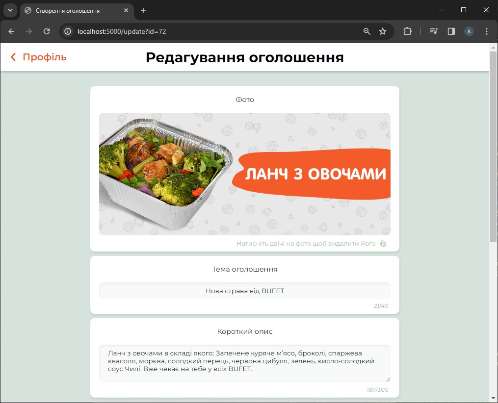

Після переходу за посиланням на редагування оголошення відкриється відповідна сторінка, на якій користувач може змінити будь-які **дані про це оголошення** та **замінити фотографію**, клікнувши по ній двічі.

### Вхід та реєстрація

  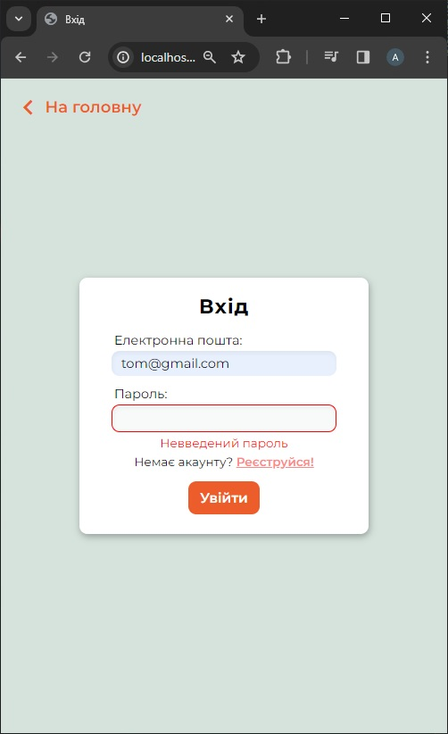
  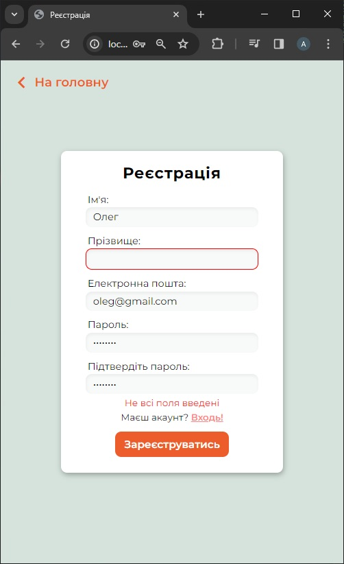

Сайт оснащений системою **авторизації** та **аутентифікації**, щоб кожен бажаючий мав можливість створювати, редагувати та аналізувати свої оголошення. Вхід та реєстрація відбувається через окремі сторінки.
